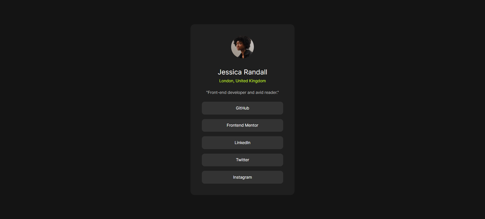

# Frontend Mentor - Social links profile solution

This is a solution to the [Social links profile challenge on Frontend Mentor](https://www.frontendmentor.io/challenges/social-links-profile-UG32l9m6dQ). Frontend Mentor challenges help you improve your coding skills by building realistic projects. 

## Table of contents

- [Overview](#overview)
  - [The challenge](#the-challenge)
  - [Screenshot](#screenshot)
  - [Links](#links)
- [Author](#author)

## Overview

### The challenge

Users should be able to:

- See hover and focus states for all interactive elements on the page

### Screenshot

### Links

- Solution URL: [Solution](https://www.frontendmentor.io/solutions/social-links-profile--Re1wtEDiI)
- Live Site URL: [Live Site](https://nikita-cheropkin.github.io/FrontendManorProject-9/social-links-profile/site20.html)

### Built with

- Semantic HTML5 markup
- Flexbox
- Mobile-first workflow

## Author

- Website - [Cheropkin Nikita](https://github.com/nikita-cheropkin)
- Frontend Mentor - [@nikita-cheropkin](https://www.frontendmentor.io/profile/nikita-cheropkin)
